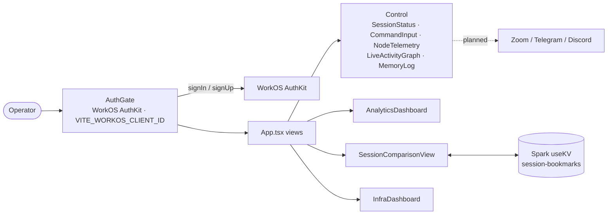

# NΞBU Operator Console

**Command-line style operator console for Zoom hosts, behind WorkOS AuthKit sign-in**

[](LICENSE)    

NΞBU is described in [`PRD.md`](PRD.md) as a precision operator console that gives **Zoom hosts** command-line style control over live sessions, with Telegram and Discord planned as remote extensions. This repo is the front end, a GitHub Spark (Vite + React) app. Users sign in through **WorkOS AuthKit** (`AuthGate`). They then get a control view (session status, command input, node telemetry, live activity graph, memory log), an analytics dashboard, a session-comparison view with bookmarks saved in Spark KV, and an infrastructure overview. Telemetry, activity and analytics figures are **static or simulated client-side** for now, and the app doesn't talk to Zoom yet. It is for Nebulosa/NEBU operators.

## Architecture



## Stack

- React 19 + TypeScript on Vite with `@vitejs/plugin-react-swc` (GitHub Spark template)
- WorkOS AuthKit (`@workos-inc/authkit-react`)
- Tailwind CSS 4, shadcn/ui on Radix, Phosphor icons ([ICONS.md](ICONS.md)), Framer Motion; Frisky frontend standard in [STACK.md](STACK.md)

## Project structure

```text
PRD.md  STACK.md  ICONS.md
src/
  main.tsx            AuthKitProvider (requires VITE_WORKOS_CLIENT_ID)
  App.tsx             control / analytics / comparison / infra views
  components/         AuthGate, CommandInput, SessionStatus, NodeTelemetry, NetworkGraph, NebuGlyph, …
```

## Local development

```bash
# Install dependencies
npm install

# Required: the app throws at startup without it
echo 'VITE_WORKOS_CLIENT_ID=…' > .env.local

# Vite dev server
npm run dev

# Type-check and production build
npm run build

# ESLint
npm run lint
```

## Environment variables

Names only. Values are never committed.

| Variable | Purpose |
|---|---|
| `VITE_WORKOS_CLIENT_ID` | WorkOS AuthKit client ID (required) |

## Deploy

No deploy target is configured in this repo (no workflows or hosting config). `npm run build` outputs a static bundle to `dist/`. Add the deployed origin as a redirect URI in the WorkOS dashboard.

## Status

Early-stage UI. It overlaps with [frisky-command-deck](https://github.com/FriskyDevelopments/frisky-command-deck), so pick one canonical operator dashboard. Related: [NEBU-](https://github.com/FriskyDevelopments/NEBU-).

## License

See [LICENSE](LICENSE).
